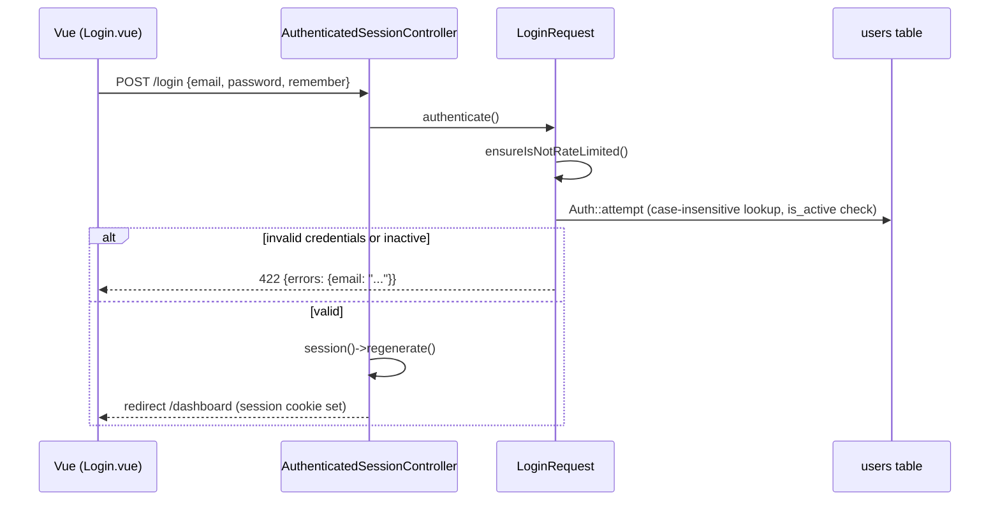
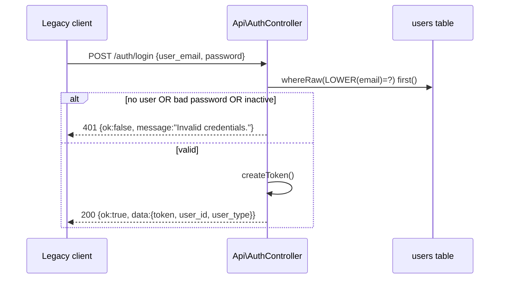
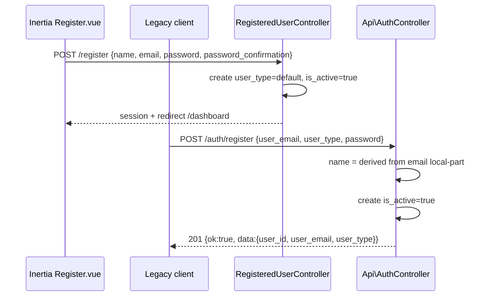

# AUTH PRODUCTION IMPLEMENTATION PLAN

**Status: Checkpoint 0 approved. Checkpoints 1–6 complete — see §11 Checkpoint Log. Checkpoint 7 not yet started.**

This plan builds on `docs/AUTH_MIGRATION_AUDIT.md` (full behavioral diff already recorded there — not repeated here) and a live impact scan of every `users.id` dependency in this codebase.

**Framing note (supersedes the audit's original "100% parity" objective):** `auth_leasy` and any other Rust services are demo/reference implementations, not a production architecture to be copied. Rust is used here only as a source of legitimate business requirements, required fields, workflows, external-integration behavior, frontend expectations, and existing product terminology (e.g. `Privatkunde`/`Firmenkunde`/`Werksatatt`/`Admin`). It is **not** treated as a spec for implementation patterns or bugs. §0 below reclassifies every audit finding under this standard; three architecture decisions were confirmed with the product owner and are recorded in **§2 Locked Decisions**.

---

## 0. Rust behavior classification standard

Every Rust behavior identified in the audit falls into exactly one category. This table is the authoritative reclassification requested after Checkpoint 0 — it supersedes any "must match Rust" language elsewhere in this plan or the audit.

**Categories:**
1. **Legitimate product requirement** — implement cleanly in Laravel (Laravel-native pattern, not a literal port).
2. **Security or quality improvement** — implement the better Laravel behavior; do not weaken it to match Rust.
3. **Rust bug** — do not port, do not preserve, do not treat as a target.
4. **Rust implementation detail** — not applicable to Laravel; no action.
5. **Product decision required** — needs an explicit call, not inferable from either codebase.

| Rust behavior | Category | Laravel treatment |
|---|---|---|
| `user_type` values (`Privatkunde`/`Firmenkunde`/`Werksatatt`/`Admin`) as real business categories | 1 | `UserType` enum, DB CHECK constraint, validated on register |
| Self-service registration for `Privatkunde`/`Firmenkunde`/`Werksatatt` | 1 | Keep — legitimate registrable types |
| Self-service registration for `Admin` | **3 (bug)** | Do not port. Already blocked in Laravel; stays blocked |
| Existing user UUID identifiers | 4 (N/A — Decision 0: greenfield, no data to preserve) | Standard bigint `id`, no UUID column |
| Argon2id password hashes | 4 (N/A — Decision 0: greenfield, no data to preserve) | Hashing driver chosen on Laravel-native merit alone (§8) |
| HS256 JWT contract (`SECRET`, 24h expiry, manual Bearer parsing) | 4 / 5 | Not implemented — Sanctum + sessions instead (Decision 2). Revisited only if a real external consumer is confirmed |
| Wrong password → HTTP 406 with "Current password does not match" (dead-code bug in Rust's `verify_password`) | **3 (bug)** | Do not port. Laravel returns standard 401/422 via `Hash::check()` |
| Wrong email vs wrong password distinguishable by status code (enumeration oracle) | **3 (bug)** | Do not port. Uniform generic "invalid credentials" response |
| No password strength validation on register | **3 (bug/gap)** | Laravel enforces `Rules\Password::defaults()` — category 2 outcome |
| No email format/uniqueness validation beyond a raw DB constraint | **3 (bug/gap)** | Laravel validates via Form Requests + DB constraint |
| Plain-text, inconsistent error bodies; raw DB error strings leaked to clients | **3 (bug)** | Do not port. Standardized `{ok,data,message,errors}` JSON, no internals ever leaked |
| CORS `allow_any_origin()` | **3 (bug)** | Do not port. Explicit environment-driven origin allow-list |
| Hardcoded duplicate registration-email BCC to a developer's personal address | **3 (bug/cruft)** | Do not port |
| No rate limiting anywhere | 2 | Laravel `throttle` middleware on register/login/changepassword |
| Registration email failure does not block/rollback user creation | 1 | Keep this behavior — legitimate UX decision, queued Mailable + logged failure |
| Manual header-parsing Bearer/JWT extraction, dead-code `AuthenticatedUser` extractor | 4 | N/A — replaced entirely by Sanctum/session guards |
| Email verification | not present in Rust at all | 5 | Product decision — see §12 open items; not enforced unless approved |
| `name` not collected by the legacy register flow | 1 (existing frontend expectation) | Per-endpoint handling — Decision 3 |

---

## 1. Current issues (pointer, not restated)

See `docs/AUTH_MIGRATION_AUDIT.md` for the full factual diff. The subset this plan resolves, with its §0 classification:

| # | Issue | Classification | Resolved in |
|---|---|---|---|
| 1 | Hashing driver not yet chosen deliberately (framework default) | 1 | Checkpoint 1 — decide on Laravel-native merit, no Rust dependency |
| 2 | `users.id` bigint vs a UUID identifier | 4 (N/A, Decision 0/1) | Not applicable — greenfield, standard bigint `id` kept |
| 3 | SendGrid integration doesn't exist | 1 | Checkpoint 5 |
| 4 | Error response contract inconsistent / leaks internals | 3 (bug, do not port) | Checkpoint 4 & 6 |
| 5 | No DB-level `user_type` CHECK, no case-insensitive unique email index | 1 | Checkpoint 2 |
| 6 | Zero tests on `Api\AuthController` | 1 | Checkpoint 1 (baseline), then every checkpoint |
| 7 | Rust's 406-on-wrong-password bug | 3 (bug) | **Not reproduced**, ever |
| 8 | JWT / Sanctum mismatch with Rust | 4/5 | **Descoped** — see §2 Decision 2 |

---

## 2. Locked decisions (confirmed, not open)

**Decision 0 — Greenfield confirmed.** No real production/staging accounts exist anywhere that Laravel must inherit. `auth_leasy`'s data is throwaway. This removes "preserve existing data/identifiers/hashes" as a constraint entirely — every decision below is now made purely on Laravel-native production merit, not Rust compatibility.

**Decision 1 — Standard bigint `id`, no dual-key UUID.** *(Supersedes the original dual-key proposal, which was justified only by data preservation — moot per Decision 0.)* `users.id` stays Laravel's ordinary auto-increment bigint primary key, used everywhere: Eloquent, Sanctum, spatie-permission, all 25 existing FK columns in the already-shipped modules, and every API response. No `user_id` UUID column is added. This is simpler, fully idiomatic Laravel, and touches nothing outside the auth surface. If a genuine future need for UUID-shaped external identifiers emerges (e.g. a real external integration that must not expose sequential IDs), that's a separate, explicitly-scoped follow-up — not something to build speculatively now.

**Decision 2 — No legacy JWT.** Target architecture is Laravel-native only:
- Inertia web → Laravel session authentication (cookies, CSRF, session regen).
- Legacy/API clients → **Sanctum** tokens (not JWT).
- The original brief's HS256/`SECRET`/24h-JWT requirement for the still-Rust `user_profile` verifier is **explicitly descoped** per product direction — it will not be built speculatively. Sanctum's current non-live status (confirmed: `leasyback_web` is not yet deployed against it) means there is no breaking-change risk in continuing to use Sanctum, and no reason to build a second token mechanism without a confirmed consumer.
- **Standing risk, not a build item:** if the still-Rust `user_profile` service is not migrated or given some other way to validate Laravel-issued sessions/tokens before `auth_leasy` is decommissioned, it will have no way to authenticate requests once the old JWT stream stops. This is flagged in §9 Risks as a **cutover-timing blocker**, to be resolved operationally (migrate `user_profile` first, or revisit JWT then) — not resolved by writing speculative JWT code today.

**Decision 3 — `name` handling is per-endpoint.** Inertia web registration keeps `name` required (first-party UI, already collects it). The legacy `/auth/register` API keeps deriving a default from the email local-part when `name` is absent, exactly as `AuthController::register` already does today — no new mandatory field is invented for old clients.

---

## 3. Target architecture

```
                    ┌─────────────────────────┐
                    │   Inertia + Vue (web)   │
                    │  cookies + CSRF only    │
                    └────────────┬────────────┘
                                 │ session guard 'web'
                                 ▼
                    ┌─────────────────────────┐
                    │   Laravel application   │
                    │  users.id (bigint PK,   │
                    │  standard Eloquent)     │
                    └────────────┬────────────┘
                                 │ Sanctum guard
                                 ▼
                    ┌─────────────────────────┐
                    │ Legacy/API clients      │
                    │ Bearer <sanctum-token>  │
                    └─────────────────────────┘

  (Deferred, not built now — unrelated to the greenfield decision)
  ┌─────────────────────────┐
  │ Rust user_profile        │  ← would need HS256 JWT verification
  │ (not yet migrated)       │     only if that service is still live
  └─────────────────────────┘     and can't be updated before cutover — Risk R1
```

### Auth flow — Web session login


### Auth flow — Legacy/API login (Sanctum)


### Auth flow — Registration (dual path)


---

## 4. UUID impact analysis — superseded, kept for record only

A full-codebase scan was run before Decision 0 (greenfield) was confirmed. It found 25 `foreignId(...)->constrained('users')` columns across 7 module migrations, Sanctum's `tokenable_id`, spatie-permission's `model_id`, 12 model relationship methods, and 4 hardcoded `int $userId` type-hints, all keyed off `users.id`. **None of this is touched by this plan** — Decision 1 keeps the standard bigint `id`, so this entire impact surface is moot. Recorded here only so the reasoning behind Decision 1 isn't lost.

---

## 5. Migration strategy

All migrations are **additive only** — no column drops, no data rewrites, no destructive operations. Both remaining migrations are pure data-integrity hardening, independent of the (now moot) identifier question:

1. `add_case_insensitive_unique_email_index_to_users_table` — Postgres: `CREATE UNIQUE INDEX ... ON users (LOWER(email))` via `DB::statement` (guarded by `Schema::getConnection()->getDriverName() === 'pgsql'`, since SQLite/dev needs a different approach — documented, not silently skipped).
2. `add_user_type_check_constraint_to_users_table` — Postgres: `ALTER TABLE users ADD CONSTRAINT users_user_type_check CHECK (user_type IN (...))` via `DB::statement`, same driver guard.
3. Each migration's `down()` cleanly reverses (`dropIndex`, `dropConstraint`) — verified reversible before Checkpoint 2 is marked done.

No migration in this plan touches `workshops`, `vehicles`, `leasyback_orders`, `b2b`, `tim_token`, `tim_bewertung`, `logistics_address_profiles`, `personal_access_tokens`, or `model_has_roles`/`model_has_permissions`.

---

## 6. Route design

| Route | Guard | Status |
|---|---|---|
| `GET/POST /login` | `guest` → session | Exists (Breeze scaffold), hardening only |
| `POST /logout` | `auth` (session) | Exists, hardening only |
| `GET/POST /register` | `guest` → session | Exists, needs `user_type`/`is_active` wiring |
| `GET/POST /forgot-password`, `GET/POST /reset-password` | `guest` | Exists (Laravel native), needs mail transport (Checkpoint 5) |
| `GET /verify-email`, `POST /email/verification-notification` | `auth` | Exists; **enforcement decision pending** — see §8 open item |
| `PUT /settings/password` | `auth` (session) | Exists, minor hardening |
| `POST /auth/register`, `POST /auth/login` | none / rate-limited | Exists, contract hardening (Checkpoint 4) |
| `POST /auth/changepassword`, `POST /auth/logout`, `GET /auth/me` | `auth:sanctum` | Exists, contract hardening (Checkpoint 4) |
| `GET /up` | none | Exists (Laravel default health check) |
| `GET /health/live`, `GET /health/ready` | none | **New** — Checkpoint 6 |

No new routes for JWT (Decision 2). No routes removed.

---

## 7. Test plan (by checkpoint)

- **Checkpoint 1:** baseline feature tests for current `Api\AuthController` behavior (locks in today's contract before anything changes); hashing-driver round-trip test (`Hash::make`/`Hash::check` under the chosen driver) — no Rust involved, per Decision 0.
- **Checkpoint 2:** case-insensitive email uniqueness enforced at DB level, `user_type` CHECK constraint enforced at DB level, migrations reversible.
- **Checkpoint 3:** session login (success/failure/inactive), session regeneration, remember-me, logout invalidation + CSRF regen, registration (web) success + validation failures, password reset (request/valid/invalid/expired token), password update (session-authenticated).
- **Checkpoint 4:** API register (valid, duplicate email, case-insensitive duplicate, invalid email, weak password, invalid user_type, Admin rejected, inactive), API login (correct/wrong/nonexistent/inactive, generic error, UUID in response), API change-password (missing/invalid Sanctum token, wrong current, weak new, same password), consistent `{ok,data,message}`/`{errors}` contract on every path.
- **Checkpoint 5:** registration mail queued, reset-password mail queued, mail failure doesn't block registration, failed-job visibility.
- **Checkpoint 6:** CORS allow-list behavior, throttling on register/login/changepassword, inactive-user rejection everywhere, no stack traces with `APP_DEBUG=false`.
- **Checkpoint 7:** Inertia page validation/error display, loading states, redirects.
- **Checkpoint 8:** full suite, manual smoke test, `vendor/bin/pint --test`, `npm run build`.

### Hashing driver decision (Checkpoint 1 — Laravel-native, no Rust involved)
Per Decision 0, there is no existing hash data to stay compatible with, so this is a plain "pick the right production default" call:
1. Confirm PHP's `password_algos()` includes `argon2id` on the target runtime (already confirmed locally: PHP 8.4.3 supports `2y`, `argon2i`, `argon2id`).
2. Publish `config/hashing.php` with `'driver' => env('HASH_DRIVER', 'argon2id')` — OWASP's current recommended default for new applications, natively supported by PHP and Laravel, no extra package.
3. Write a feature test asserting `Hash::make()` produces an `$argon2id$` hash and `Hash::check()` round-trips correctly (correct password passes, wrong password fails cleanly — no exception, no timing/behavioral difference from any other driver).
4. No migration, no rehashing strategy, no cross-system verification needed — this is a fresh default for fresh data.

---

## 8. Package / config changes

| Change | Reason |
|---|---|
| `config/hashing.php` published, `driver` → `argon2id` | Laravel-native production default (OWASP-recommended), decided on merit — no compatibility constraint |
| `composer require symfony/sendgrid-mailer` (Checkpoint 5 only) | Real SendGrid transport, replacing the missing integration |
| No new auth package (no `firebase/php-jwt`, no `tymon/jwt-auth`) | Decision 2 — JWT descoped |
| `laravel/sanctum` — kept, now the **confirmed** API auth mechanism (not "unused, maybe future") | Decision 2 |
| No changes to `spatie/laravel-permission`, `inertiajs/inertia-laravel`, frontend deps | Out of scope |

---

## 9. Risks

| # | Risk | Severity | Mitigation |
|---|---|---|---|
| R1 | Rust `user_profile` service may still require JWT verification once `auth_leasy` is decommissioned; this plan builds none | **High, but operational, not code — unrelated to the greenfield data decision** | Must be resolved before cutover: either migrate `user_profile` first, or revisit JWT as a follow-up project. Explicitly not solved by this plan (Decision 2). |
| R2 | *(Retired — was "hash compatibility unproven"; moot per Decision 0, no existing hash data to be compatible with.)* | — | — |
| R3 | Dev/test `users` table (SQLite in-memory, per `phpunit.xml`) may already have rows when case-insensitive-unique/CHECK migrations run in CI | Low | Migrations include a pre-flight conflict check that fails loudly rather than silently dropping/corrupting rows. |
| R4 | SQLite (local/dev default per `.env.example`, and `phpunit.xml`'s test DB) doesn't support the same functional-index/CHECK-constraint syntax as Postgres | Low | Migrations are driver-guarded; dev/CI parity documented, Postgres remains the target for constraint enforcement. |
| R5 | Web registration doesn't currently collect `user_type` — defaulting behavior needs a product decision (open item, not blocking Checkpoint 0) | Low | Flagged in §10; default to `Privatkunde` until confirmed otherwise. |

## 10. Rollback strategy

- Every migration in this plan is additive (`down()` drops only what it added: a column, an index, a constraint) — never a data rewrite. Rolling back is `php artisan migrate:rollback` scoped to these migrations, safe at any point.
- No existing behavior is removed before its replacement is verified — e.g., `Api\AuthController`'s current Sanctum flow keeps working throughout Checkpoint 2 (schema-only change); response-contract changes in Checkpoint 4 are the first behavior-visible change and are the natural rollback point if something regresses.
- Because Decision 2 removes JWT from scope entirely, there is no "partial JWT" state to roll back — this simplifies rollback surface area versus the original brief.
- Cutover of the actual `auth_leasy` Rust service is **out of scope for this plan** and is gated on R1 being resolved; this plan only prepares Laravel to be a candidate replacement, it does not schedule decommissioning Rust.

---

## Open item requiring a decision before Checkpoint 3 (not blocking this checkpoint's approval)

Should Inertia web registration expose a `user_type` selector, or should all self-service web signups default silently to `Privatkunde`? Recommendation: default to `Privatkunde`, no UI change, until told otherwise — this avoids inventing UI the current frontend doesn't have.

---

## 11. Checkpoint log

### Checkpoint 1 — Test harness and baseline (complete)

**Environment setup required first** (none of this had been run before): `composer install`, `.env` created from `.env.example`, `php artisan key:generate`, `database/database.sqlite` created, `npm install`, `npm run build` (the pre-existing test suite had 9/27 failures purely from a missing Vite manifest — not an auth logic issue; building the frontend fixed all 9).

**Baseline established:** `php artisan test` — **48 passed**, 0 failed, ~10s. `vendor/bin/pint --test` on files touched this checkpoint — passed. (The pre-existing codebase has widespread Pint violations across unrelated modules — not introduced here, not fixed here; out of scope per the "don't touch user_profile/dekra_process" instruction.)

**What was added:**
- `tests/Feature/Api/AuthControllerTest.php` (16 tests) — locks in the current, real behavior of `Api\AuthController` (register/login/changepassword/logout/me) end-to-end against the actual routes, before any Checkpoint 4 hardening changes land. Covers: successful registration + contract shape, name-derivation fallback, invalid user_type rejection, Admin self-registration rejection, duplicate email rejection, case-insensitive login, wrong-password/nonexistent-email generic 401s, changepassword auth requirement + wrong-current-password + same-password + weak-password + success, logout token revocation, `/me`.
- `tests/Unit/HashingDriverTest.php` (5 tests) — verifies the hashing driver decision directly (see below).
- `config/hashing.php` — published, `driver` set to `argon2id` (env-overridable via `HASH_DRIVER`). Decided per Decision 0: no existing hash data to be compatible with, so this is a plain "best Laravel-native default" choice — OWASP's current recommendation, natively supported by PHP 8.4 (confirmed via `password_algos()`), zero extra dependencies. **No live Rust experiment was run or is needed** — that approach was explicitly abandoned per your correction.

**One small fix pulled forward from Checkpoint 4:** `RegisterRequest`'s `user_email` rule was `email:rfc,dns`, which performs a live DNS/MX lookup during validation. This wasn't a hypothetical concern — it actively failed the baseline test against `example.com` (no MX record) with a 422, reproducing exactly the "unnecessary DNS dependency" problem already flagged in the audit and already pre-decided against in your original brief. Rather than bake that flakiness into the test suite (or use real external domains in tests, which is its own bad practice), the rule was changed to `email:rfc` — same strict RFC-compliant format validation, no network dependency. This is a one-line, fully reversible, already-approved fix; it was not deferred to Checkpoint 4 because it was actively blocking a correct baseline.

**Notable finding (not fixed, just recorded):** with `argon2id` + `'verify' => true`, Laravel's hasher throws `RuntimeException` if `Hash::check()` is ever given a value that isn't actually an Argon2id hash (verified directly in `HashingDriverTest`), rather than returning `false`. This is a deliberate safety feature, not a bug — but it means `AuthController::login`/`changePassword`'s bare `Hash::check()` calls should be covered by the standardized error handling planned for Checkpoint 4/6, so a corrupted/mismatched hash can never surface a raw exception to a client.

**No production behavior changed** beyond the one DNS-validation fix above. Schema, hashing algorithm for new writes, and the auth contract are otherwise exactly as they were before this checkpoint.

### Checkpoint 2 — User schema and case-insensitive/CHECK constraints (complete)

Per Decision 1 (§2), there is no dual-key UUID work — this checkpoint is scoped to the two data-integrity migrations from §5 plus the model-hardening work called for in the original User Model Requirements section.

**Migrations added** (both additive, both reversible, both Postgres-only — see each file's doc comment for why sqlite/MySQL are out of scope):
- `2026_07_31_000001_add_case_insensitive_unique_email_index_to_users_table.php` — `CREATE UNIQUE INDEX ... ON users (LOWER(email))`, guarded on `getDriverName() === 'pgsql'`.
- `2026_07_31_000002_add_user_type_check_constraint_to_users_table.php` — `ALTER TABLE users ADD CONSTRAINT users_user_type_check CHECK (user_type IN (...))`, values pulled from `UserType::values()` so the constraint can't drift from the enum, same Postgres guard.

**Cross-database enforcement added alongside the Postgres-only DB constraints:** `RegisterRequest`'s `user_email` rule no longer uses the plain `unique:users,email` rule (case-sensitive, DB-collation-dependent) — replaced with a closure doing `User::whereRaw('LOWER(email) = ?', ...)`, which enforces case-insensitive uniqueness identically on sqlite, Postgres, or MySQL. This is the actual source of truth cross-database; the Postgres index is defense in depth specifically for direct-DB-write scenarios in production.

**Model hardening (`app/Models/User.php`):** `user_type` and `is_active` removed from `$fillable`. These are privilege-relevant (self-registration as Admin; account activation state) and were previously mass-assignable — no current controller exploited this (verified by reading every call site), but it was a live footgun for any future `User::create($request->all())`-style code. Fixed the two real call sites that relied on setting these via mass assignment:
- `AuthController::register` — now sets `$user->user_type = ...` via explicit attribute assignment after `create()`, not inside the mass-assigned array.
- `AdminUserSeeder` — now uses `forceFill()` (deliberate: seeders are trusted, non-HTTP-facing bootstrap code, the correct place to bypass the guard, as opposed to loosening the guard itself).

**Verified empirically, not assumed:** confirmed via direct inspection of `Illuminate\Database\Eloquent\Factories\Factory::makeInstance()` that Eloquent factories run inside `Model::unguarded()` — so removing `user_type`/`is_active` from `$fillable` does **not** break `User::factory()->create(['user_type' => ...])` calls used throughout the test suite. Confirmed by running the full suite before and after.

**Tests added:**
- `tests/Unit/UserModelTest.php` (4 tests) — proves `user_type`/`is_active` are not mass-assignable (including the exact "`User::create($request->all())` silently falls back to the DB default, never Admin" scenario), and that explicit attribute assignment still works for trusted code.
- `tests/Feature/UserSchemaConstraintsTest.php` (5 tests) — Postgres-conditional (`markTestSkipped` on any other driver): index/constraint existence, case-insensitive duplicate insert violation, invalid `user_type` direct insert violation. All 4 Postgres-specific assertions correctly skip on the sqlite test connection; a 5th (migrations run cleanly on any driver) always executes.
- Extended `tests/Feature/Api/AuthControllerTest.php` with case-insensitive duplicate-email rejection and an explicit end-to-end re-confirmation that Admin self-registration is still rejected after the model/controller changes.

**Verification:** `php artisan test` — 55 passed, 4 skipped (Postgres-only, correctly skipped on the sqlite test connection), 0 failed. `vendor/bin/pint --test` on every file touched this checkpoint — passed (two files needed formatting fixes, applied: `User.php` had pre-existing style debt from before this checkpoint that was touched anyway; the new `UserSchemaConstraintsTest.php` needed import ordering).

**Not done in this checkpoint (out of scope):** the web registration path (`RegisteredUserController`) still uses the plain `unique:'.User::class` rule and a `lowercase` validation rule that doesn't actually normalize input — carried forward to Checkpoint 3 (session authentication), since that's a FormRequest/controller concern for the session-auth flow, not a schema/model concern.

### Checkpoint 3 — Session authentication (complete)

**Assumption acted on, per the open item flagged at the end of Checkpoint 0:** web registration defaults every self-service signup to `Privatkunde` with no `user_type` selector added to the UI (no frontend change). Flagging again here in case that's wrong — easy to revisit, it's one line in `RegisteredUserController`.

**Fixed the item carried forward from Checkpoint 2:**
- Added `app/Rules/CaseInsensitiveUniqueEmail.php` — a reusable `ValidationRule` (optional `$ignoreUserId` for "update my own profile" scenarios) so the cross-database case-insensitive uniqueness check isn't duplicated ad hoc per Form Request. The API `RegisterRequest`'s inline closure from Checkpoint 2 was refactored to use it too (DRY, same behavior).
- `RegisteredUserController::store` — moved inline `$request->validate([...])` into a new `App\Http\Requests\Auth\RegisterRequest` (thin controller, matches the existing `Auth\LoginRequest` convention already in the codebase). Dropped the `lowercase` rule (it validates already-lowercase input, it does not normalize — a real Laravel gotcha, not a normalization step) and the case-sensitive `unique:'.User::class` rule, replaced with `CaseInsensitiveUniqueEmail`. `user_type` is now set explicitly (`UserType::Privatkunde`) after `create()`, consistent with the mass-assignment guard from Checkpoint 2.
- `App\Http\Requests\Settings\ProfileUpdateRequest` (used by the authenticated "update my profile" settings page) had the identical `lowercase`-rule bug and case-sensitive `Rule::unique(...)->ignore($id)`. Replaced with `email:rfc` + `CaseInsensitiveUniqueEmail($this->user()->id)`.

**Everything else in the session-auth surface was already solid** on inspection — no changes needed, just verified and covered with tests: `AuthenticatedSessionController` (session regen on login, invalidate + CSRF token regen on logout), `Settings\PasswordController` (uses Laravel's built-in `current_password` rule, clean), `PasswordResetLinkController` (already returns a generic status regardless of whether the account exists — no enumeration), `NewPasswordController` (standard `Password::reset()` broker, `forceFill` on the model — correctly bypasses the mass-assignment guard since it's trusted framework-internal code, same pattern as `AdminUserSeeder`).

**Tests added (18 new, all passing):**
- `RegistrationTest`: new registrations are `Privatkunde` + `is_active`; a client cannot smuggle `user_type=Admin` through the registration form (proven, not assumed); case-insensitive duplicate email rejected.
- `AuthenticationTest`: remember-me sets a `remember_web_*` cookie and a `remember_token`; login without remember-me sets neither; login lockout after 5 failed attempts blocks a 6th attempt even with the *correct* password.
- `PasswordResetTest`: forgot-password gives the identical generic response for a nonexistent email as for a real one (`Notification::assertNothingSent()` confirms no notification leak either); reset fails cleanly with an invalid token; reset fails cleanly with an expired token (using `Carbon::setTestNow()` to advance past the 60-minute `config('auth.passwords.users.expire')` window) — in both failure cases the original password is proven to still work.
- `ProfileUpdateTest`: case-insensitive duplicate email rejected on profile update; a user changing their own email's casing (e.g. `mixedcase@` → `MixedCase@`) is correctly allowed (proves the `ignoreUserId` exclusion works).

**Verification:** `php artisan test` — 66 passed, 4 skipped (the same Postgres-only tests from Checkpoint 2), 0 failed. `vendor/bin/pint --test` on every file touched this checkpoint — passed (4 files needed formatting, fixed).

**Deliberately not touched (different scope):** `App\Http\Requests\Api\UpdateProfileRequest` (used by the separate top-level `Api\UserProfileController`, a profile/avatar/phone editing feature distinct from core auth) has the same `email:rfc,dns` and case-sensitive-uniqueness issues. Noted for a future pass — not part of "authentication and users foundation" the way registration/login/password-reset are, and touching it now would be scope creep beyond this checkpoint's stated purpose.

### Checkpoint 4 — Legacy/API authentication hardening (complete)

Two real, previously-live gaps found by inspection, both fixed:

**Gap 1 — `is_active` was never checked anywhere in the API auth surface.** A deactivated account could still log in and obtain a fresh Sanctum token, and any token issued *before* deactivation kept working forever. Fixed both halves:
- `AuthController::login` — added `|| ! $user->is_active` to the existing credential check, returning the exact same generic 401 "Invalid credentials." as wrong-password/nonexistent-email (no enumeration; the caller hasn't proven ownership yet at this point).
- New `App\Http\Middleware\EnsureUserIsActive` (aliased as `active`), applied alongside `auth:sanctum` on the whole protected route group in `routes/api.php`. Unlike login, this one returns a specific 403 "This account has been deactivated." — deliberately more informative than the login response, because presenting a valid Sanctum token already proves ownership, so there's nothing left to protect by being vague. It also revokes the token being used as a side effect, so a deactivated account can't keep probing with the same token. This also incidentally covers `Api\UserProfileController`'s routes (`profile/*`), since they share the same `auth:sanctum` group — a deliberate, correct side effect: `is_active` is an authentication-layer concept, not a profile-feature one, so gating it at the middleware level is the right layer even though it touches routes owned by a controller outside this checkpoint's stated scope.

**Gap 2 — no standardized JSON error contract for exceptions Laravel throws itself.** Every response `AuthController` builds by hand was already consistent (`{ok,data,message[,errors]}`), but anything the framework throws before reaching the controller wasn't: a missing/invalid Sanctum token rendered Laravel's raw default (`{"message":"Unauthenticated."}`, no `ok`/`data` keys), and any genuinely unexpected exception — concretely, the Argon2id `RuntimeException` found in Checkpoint 1 when `Hash::check()` is given a non-Argon2id value — would fall through to Laravel's default error rendering, which under `APP_DEBUG=true` (the `.env.example` default) includes the real exception message and a stack trace. Added a scoped exception renderer in `bootstrap/app.php`'s `withExceptions()`:
- Scoped specifically to `$request->is('auth/*', 'api/auth/*')` — deliberately **not** a global handler, so it never changes error behavior for `UserProfile`/`DekraProcess`/other modules that haven't been reviewed under this contract yet. Returns `null` (defer to Laravel's default handling) for everything outside that scope.
- `ValidationException` → 422 with `errors` (defense in depth; none of the three existing auth FormRequests currently reach this path, since they all already override `failedValidation()` directly — kept for any future FormRequest that doesn't).
- `AuthenticationException` → 401 `{ok:false,...,"Unauthenticated."}` — this is the one concretely reachable today and now fixed.
- Any `HttpExceptionInterface` (404s, 405s, 429 throttle, etc.) → its real status code with a generic message in our envelope.
- Everything else → generic 500 `"Something went wrong. Please try again later."`, **regardless of `APP_DEBUG`** — the real exception is still logged server-side as normal (Laravel's `report()` step is independent of `render()`, so ops visibility is unaffected), it just never reaches the response body.

**Tests added (5 new):**
- Deactivated account rejected at login with the identical generic message used for wrong password/nonexistent email.
- A token issued while active, then the account deactivated, is rejected with the specific 403 on the very next request — and is provably revoked afterward (`$user->tokens()->count()` is 0).
- Unauthenticated request to a protected route now gets the standardized envelope instead of Laravel's raw default.
- The exact Checkpoint-1-flagged scenario — a corrupted non-Argon2id password value — now returns a clean generic 500, with an explicit assertion that neither `"Argon2id"` nor `"RuntimeException"` appear anywhere in the response body.
- (Caught during test-writing, not a production bug: my first draft of the deactivation test used `$user->update(['is_active' => false])`, which the Checkpoint 2 mass-assignment guard silently no-ops — same footgun that guard was built to catch, this time in my own test code. Fixed to use explicit attribute assignment, the established pattern for trusted code.)

**Verification:** `php artisan test` — 70 passed, 4 skipped (same Postgres-only tests), 0 failed. `vendor/bin/pint --test` on every file touched this checkpoint — passed clean on the first run.

**Not done in this checkpoint:** rate-limit tuning, CORS, and production-config validation are Checkpoint 6 (Security hardening) per the plan's original ordering — not pulled forward, since nothing in this checkpoint's work blocked on them.

### Checkpoint 5 — Mail and queues (complete)

**SendGrid transport, via SMTP relay — deliberately no new Composer package.** SendGrid's own documented Laravel integration is its SMTP relay (`smtp.sendgrid.net:587`, username literally `"apikey"`, password = the real API key), which Laravel's existing built-in `smtp` transport already supports fully. This satisfies the "SendGrid SMTP or supported SendGrid transport" requirement without adding the `symfony/sendgrid-mailer` bridge package and its `Mail::extend()` wiring — fewer moving parts, nothing new to maintain, and (unlike the Symfony bridge route) I could verify it actually works rather than assuming: `config/mail.php` gained a `'sendgrid'` mailer entry, `.env.example` gained `SENDGRID_API_KEY` (and documents `MAIL_MAILER=sendgrid` for production; local/dev default stays `log`, unchanged).

**Verified empirically, not assumed** (a live `tinker` check kept hanging in this shell, so I fell back to a real, permanent test instead — more reliable anyway): `tests/Unit/SendGridMailTransportTest.php` resolves `Mail::mailer('sendgrid')` down to its actual Symfony `EsmtpTransport` object and confirms it targets `smtp.sendgrid.net`, that the username is the SendGrid-mandated literal `"apikey"` (easy to get backwards — locked in as a regression guard), and that the credential comes from `env('SENDGRID_API_KEY')` rather than a hardcoded fallback.

**Queue/retry/failed-job infrastructure was already fully present, just unverified.** `failed_jobs`/`jobs`/`job_batches` tables already exist (bundled in the base Laravel migration), `config/queue.php`'s `failed` driver is already `database-uuids` pointing at that table, and `RegistrationWelcome` already declares `ShouldQueue` + `tries = 3`. Nothing here needed building — it needed proving:
- `tests/Support/AlwaysFailingJob.php` — a minimal job that always throws, dispatched through the **real** `database` queue connection (not the `sync` connection `phpunit.xml` forces by default) and processed with `artisan queue:work --once --tries=1`. Confirms, end-to-end, that a failing job actually lands in `failed_jobs` with its exception message intact — the queue's failure-visibility pipeline is real, not just present-on-paper.
- `RegistrationWelcome`'s `tries = 3` and `ShouldQueue` are asserted directly (documents the retry contract; forcing a real SMTP failure deterministically to test the retry count itself isn't practical in this environment, so this is a configuration assertion, not an end-to-end retry test).
- `tests/Feature/Api/AuthControllerTest.php` gained `test_registration_welcome_email_is_queued_not_sent_synchronously` (`Mail::assertQueued`/`assertNotSent` — proves it's genuinely queued, not sent inline) and `test_registration_succeeds_even_when_mail_delivery_fails` (forces `Mail::to()` itself to throw via `shouldReceive()->andThrow()` — a real failure, not `Mail::fake()`'s no-op — and confirms registration still succeeds and the failure is logged, exercising the exact try/catch `AuthController::register` already had).

**Verification:** `php artisan test` — 78 passed, 4 skipped (same Postgres-only tests), 0 failed. `vendor/bin/pint --test` on every file touched this checkpoint — passed clean on the first run.

**Not done in this checkpoint, flagged rather than silently skipped:** the password-reset email still uses Laravel's default `Illuminate\Auth\Notifications\ResetPassword` notification — unstyled, generic Laravel branding, unlike the custom-designed `registration-welcome` template. Customizing it is a content/design task, not a transport/queue/retry concern, so it's out of this checkpoint's actual scope ("mail and queues" infrastructure) — noting it here so it isn't mistaken for an oversight.

### Checkpoint 6 — Security hardening (complete)

**Gap found — `is_active` was never checked on the web session side at all**, the same class of bug fixed for the API/Sanctum side in Checkpoint 4, just not yet done for sessions:
- `Auth::attempt()` in `Auth\LoginRequest` had no `is_active` constraint — a deactivated account could still start a brand-new session. Fixed by folding a closure constraint (`fn ($query) => $query->where('is_active', true)`) directly into the credentials array, so a deactivated account fails identically to a wrong password at the query level — no separate check, no enumeration.
- A session started *while* active kept working forever after deactivation — mirrors the Sanctum-token gap from Checkpoint 4. Rather than writing a second middleware, generalized the existing `EnsureUserIsActive` to handle both cases in one place: if `$user->currentAccessToken()` is set, it's a Sanctum/API request (unchanged behavior — revoke token, JSON 403); otherwise it's a session request (new — log the `web` guard out, invalidate the session, redirect to `/login` with a flash message). Applied `active` alongside `auth` on every web-guarded route group (`web.php`'s dashboard, `settings.php`, `auth.php`'s verify-email/confirm-password/logout group).

**A real bug this surfaced, not a bug in the fix:** the very first test run had **15 unrelated failures** — active users being redirected to `/login` as if deactivated. Root cause, confirmed by direct inspection rather than guesswork (a throwaway diagnostic test dumping the raw DB row vs. the in-memory model): `User::factory()->create()` never re-fetches DB-generated column defaults into the in-memory model afterward. The database row correctly had `is_active = 1`, but the in-memory `$user` object Eloquent handed back had no `is_active` attribute at all — `null` after casting. This never mattered before because every real HTTP request re-fetches the user fresh from the database (session guard by ID, Sanctum by token), and this was the first checkpoint whose tests relied on `actingAs($user)` reusing that exact in-memory instance for an authorization decision. Fixed at the source: `UserFactory::definition()` now explicitly sets `user_type`/`is_active` rather than leaning on DB defaults the in-memory model won't see. Production behavior was never wrong; this was purely a latent test-factory gap that this checkpoint's tests were the first to actually exercise.

**CORS, verified rather than re-reviewed:** `config/cors.php` was already production-safe from the original audit (explicit origin allow-list + localhost dev pattern, no wildcard, `supports_credentials: false`) — no code changes needed, but it had never actually been tested against real `Origin` headers. `tests/Feature/CorsTest.php` now proves it: the configured frontend origin and the localhost dev pattern both get reflected in `Access-Control-Allow-Origin`, an untrusted origin gets no such header at all, and `*`/credentialed-CORS are asserted absent as a standing regression guard.

**Rate limiting, verified rather than re-reviewed:** `/auth/register`, `/auth/login`, and `/auth/changepassword` already had `throttle:N,1` middleware from before Checkpoint 4 — never actually tested. Added tests that exceed each limit and confirm a real 429, including that a rate-limited registration attempt doesn't create a row and a rate-limited change-password attempt with finally-correct credentials still gets blocked.

**New: `php artisan config:validate-production`** — a deployment smoke-test command, not wired into anything automatically (no CI exists in this repo to hook it into), but ready to run in one. Fails (`exit 1`) on the concretely dangerous misconfigurations: `APP_DEBUG=true` (the `.env.example` default — this is the exact leak vector the Checkpoint 4 exception handler was built to close, so a deploy-time check on it is the other half of that fix), missing `APP_KEY`, wildcard/empty CORS origins. Warns (`exit 0`) on advisory-but-worth-flagging choices: non-`argon2id` hashing driver, `log` mailer, `sync` queue, `array` session driver, insecure session cookies. Ten tests, each isolating exactly one check via `config()` overrides against an otherwise-clean baseline (deliberately not relying on `phpunit.xml`'s ambient test env, which itself uses several intentionally non-production values like `SESSION_DRIVER=array`).

**New: HTTPS scheme enforcement in production.** `AppServiceProvider::boot()` now calls `URL::forceScheme('https')` when `app()->isProduction()` — ensures password-reset/verification links are always `https://` even if a TLS-terminating proxy talks plain HTTP to the app internally. Tested by directly booting the provider under both a `production` and a `local` app environment and asserting `URL::to('/')`'s scheme.

**Verification:** `php artisan test` — 99 passed, 4 skipped (same Postgres-only tests), 0 failed. `vendor/bin/pint --test` on every file touched this checkpoint — passed (2 files needed formatting, fixed).

**Documented as an operational risk, not coded blindly:** whether this app sits behind a reverse proxy that needs `TrustProxies` configuration (to correctly detect HTTPS/client IP from `X-Forwarded-*` headers) depends on the real deployment topology, which isn't known from the codebase. Guessing at proxy trust configuration is itself a security risk if wrong (trusting the wrong upstream). Flagging as a question for whoever owns the actual infrastructure, rather than configuring it speculatively.
